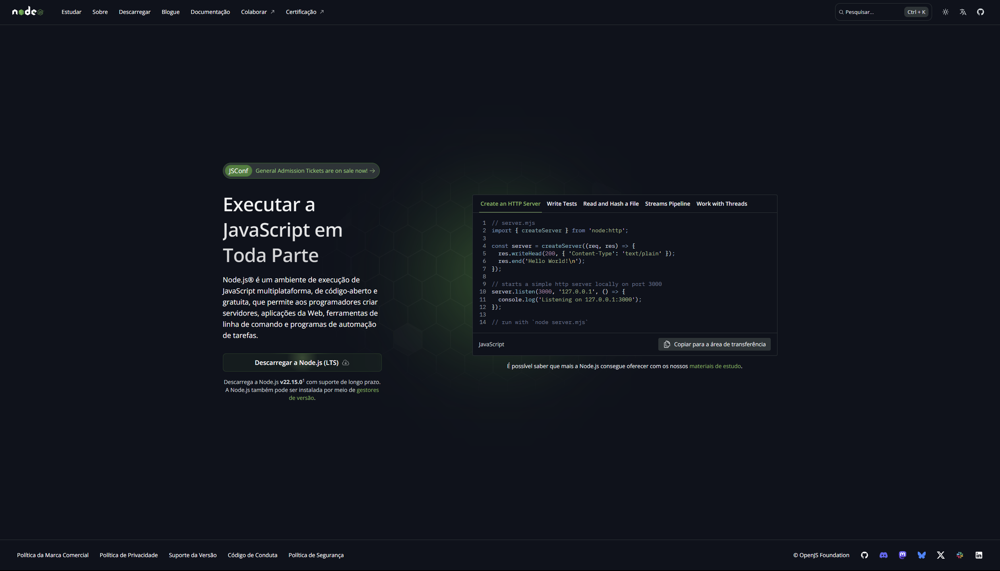
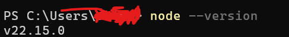
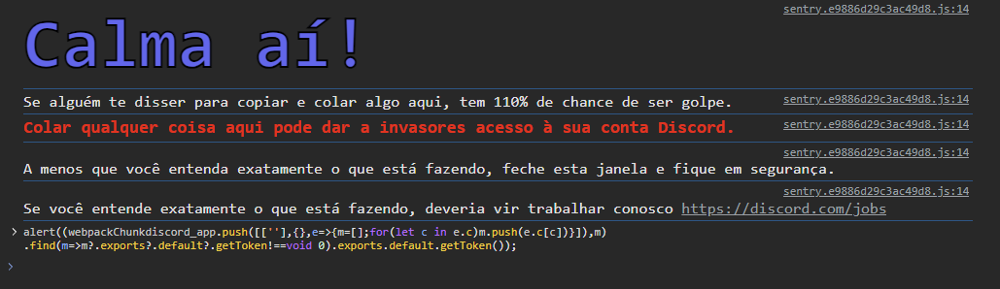
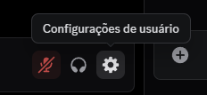
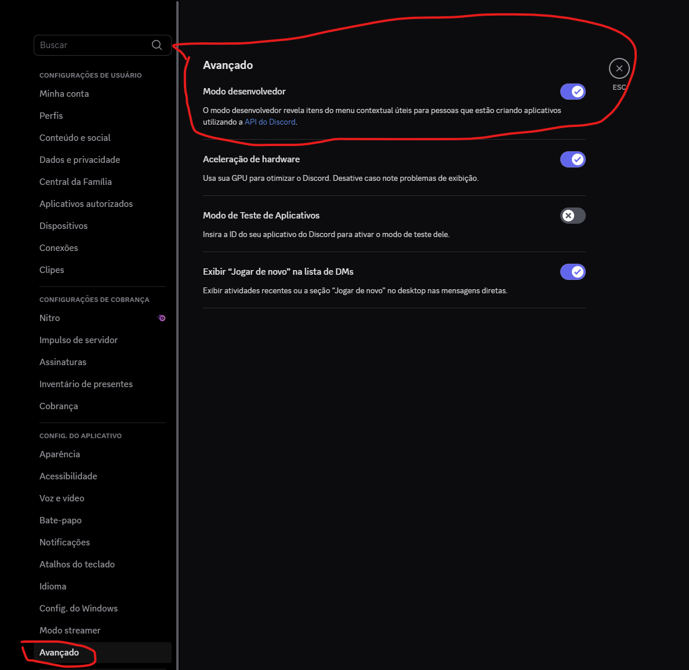
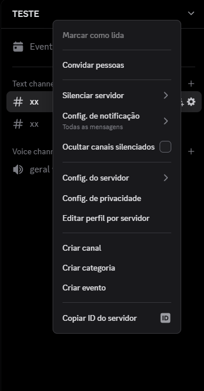

# Cloner-Server-Discord     

Tutorial 

1. Abra o DISCORD WEB

2. Logue com a sua conta do DISCORD

3. Dependendo do seu navegador (Inspecione o elemento da pagina do discord)
CTRL + SHIFT + I = Opera GX /// F12 = Google Chrome

 -> Vá em CONSOLE e digite o script abaixo:

4. Depois que pegar o seu TOKEN baixe o Node.js na sua ultima versão em "https://nodejs.org/pt"

5. Assim que o Node.js estiver instalado no seu sistema, vá no terminal e digite "node --version" pra ver a versão e se realmente instalou o Node.js!

6. Com o ambiente JavaScript instalado clique no arquivo "instalar.bat" e depois "iniciar.bat" para iniciar o script

7. O Programa irá pedir as informações abaixo...

√ Token da conta » TOKEN DA SUA CONTA
√ ID Do servidor que você irá copiar » xxx  
? ID Do servidor que receberá a cópia » xxx

8. A imagem abaixo mostra como pegar os ID's dos servidores e como habilitar o modo desenvolvedor pra poder pegar os mesmos.

I - Vai em configurações do usuário.
 

II - Depois clica em avançado e marca a caixinha de "Modo desenvolvedor"

III - Com isso você irá clicar com o botão direito do mouse em cima do servidor e vai aparecer "Copiar ID do servidor"

IV - E por fim copia e cola o código referente ao servidor que você quer copiar e o outro que receberá a copia

FIM!

